# Лабораторная работа 1


### Задание 1

```python
name = input("Имя: ")
age = int(input("Возраст: "))
print(f"Привет, {name}! Через год тебе будет {age + 1}.")
```

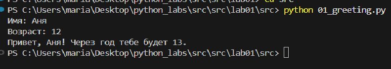


### Задание 2

```python
a = float(input("a: ").replace(",", "."))
b = float(input("b: ").replace(",", "."))
sum_ab = a + b
avg_ab = sum_ab / 2
print(f"sum={sum_ab:.2f}; avg={avg_ab:.2f}")
```

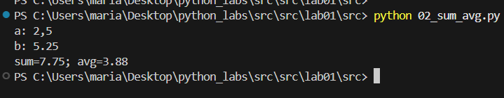


### Задание 3

```python
price = float(input("price: ").replace(",", "."))
discount = float(input("discount: ").replace(",", "."))
vat = float(input("vat: ").replace(",", "."))
base = price * (1 - discount / 100)
vat_amount = base * (vat / 100)
total = base + vat_amount
print(f"База после скидки: {base:.2f} ₽")
print(f"НДС:               {vat_amount:.2f} ₽")
print(f"Итого к оплате:    {total:.2f} ₽")
```

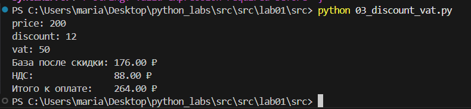


### Задание 4

```python
m = int(input("Минуты: "))
hours = m // 60
minutes = m % 60
print(f"{hours}:{minutes:02d}")
```

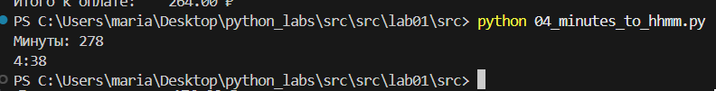

### Задание 5

```python
full_name = input("ФИО: ").strip()
chars = len(full_name.replace(' ', ''))

words = full_name.split()
initials = ''.join(word[0].upper() for word in words if word)


print(f"Инициалы: {initials}.")
print(f"Длина: {chars + 2}")
```

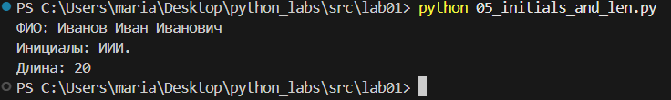


### Задание 7

```python
s = input()
result = ""
start = -1
for i in range(len(s)):
    if s[i].isupper():  
        result = result + s[i]  
        start = i  
        break
sec_pos = -1
for i in range(len(s)):
    if s[i].isdigit() and i + 1 < len(s):  
        result = result + s[i + 1]  
        sec_pos = i + 1  
        break
step = sec_pos - start
c_pos = sec_pos + step
while c_pos < len(s):
    if s[c_pos] == '.':  
        result = result + s[c_pos]  
        break 
    result = result + s[c_pos]  
    c_pos = c_pos + step  
print(result)
```

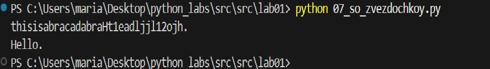


# Лабораторная работа 2

### Задание 1(A)

```python
def min_max(nums):
    """
    Находит минимальное и максимальное значение в списке
    """
    if not nums:
        raise ValueError
    return (min(nums), max(nums))

print('min_max:')
print(min_max([3, -1, 5, 5, 0]))     
print(min_max([42]))                 
print(min_max([-5, -2, -9]))
try:
    print(min_max([]))
except ValueError as mistake:
    print(mistake) 
print(min_max([1.5, 2, 2.0, -3.1])) 

def unique_sorted(nums):
    """
    Возвращает отсортированный список уникальных значений
    """
    if not nums:
        return []
    return sorted(set(nums))
print('unique_sorted:')
print(unique_sorted([3, 1, 2, 1, 3]))     
print(unique_sorted([]))                 
print(unique_sorted([-1, -1, 0, 2, 2]))         
print(unique_sorted([1.0, 1, 2.5, 2.5, 0])) 


def flatten(nums):
    """
    Преобразует список списков/кортежей в один список
    """
    resultat = []
    for number in nums:
        if not isinstance(number, (list, tuple)):
            raise TypeError('строка не строка строк матрицы')
        resultat.extend(number)
    return resultat
print('flatten:')
print(flatten([[1, 2], [3, 4]]))     
print(flatten([[1, 2], (3, 4, 5)]))                 
print(flatten([[1], [], [2, 3]]))         
try:
    print(flatten([[1, 2], "ab"]))
except TypeError as mistake:
    print(f"TypeError: {mistake}")

```

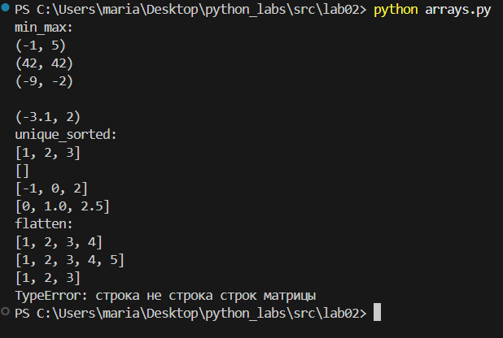


### Задание 2(B)

```python

def transpose(nums):
    """
    меняет строчки и столбики местами
    """
    if not nums:
        return []
    first_number = len(nums[0])
    if any(len(number) != first_number for number in nums):
        raise ValueError("рваная матрица")
    
    return list(map(list, zip(*nums)))

print('transpose:')
print(transpose([[1, 2, 3]]))
print(transpose([[1], [2], [3]]))
print(transpose([[1, 2], [3, 4]]))
print(transpose([]))
try:
    print(transpose([[1, 2], [3]]))
except ValueError as mistake:
    print(mistake)


def row_sums(nums):
    """
    Вычисляет суммы элементов каждой строчки матрицы
    """
    if not nums:
        return []
    first_number = len(nums[0])
    if any(len(number) != first_number for number in nums):
        raise ValueError("рваная матрица")
    
    return [sum(number) for number in nums]

print('row_sums:')
print(row_sums([[1, 2, 3], [4, 5, 6]]))
print(row_sums([[-1, 1], [10, -10]]))
print(row_sums([[0, 0], [0, 0]]))
try:
    print(row_sums([[1, 2], [3]]))
except ValueError as mistake:
    print(mistake)


def col_sums(nums):
    """
    Вычисляет суммы элементов каждого столбика в матрице
    """
    if not nums:
        return []
    first_number = len(nums[0])
    if any(len(number) != first_number for number in nums):
        raise ValueError("рваная матрица")
    
    return [sum(every) for every in zip(*nums)]
print(col_sums([[1, 2, 3], [4, 5, 6]]))
print(col_sums([[-1, 1], [10, -10]]))
print(col_sums([[0, 0], [0, 0]]))
try:
    print(col_sums([[1, 2], [3]]))
except ValueError as mistake:
    print(mistake)


```
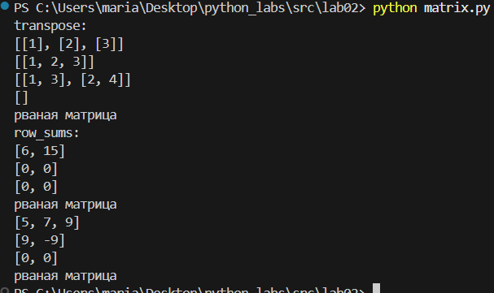


### Задание 3(C)

```python

def data(chars):
    """
    переводит данные студента в строчку с инициалами
    """
    if not isinstance(chars, tuple) or len(chars) != 3:
        raise ValueError()
    
    if not isinstance(chars[0], str):
        raise TypeError()
    if not isinstance(chars[1], str):
        raise TypeError()
    if not isinstance(chars[2], (int, float)):
        raise TypeError()
    
    student_fio = ' '.join(chars[0].split()) 
    student_group = chars[1].strip()
    
    if not student_fio:
        raise ValueError()
    if not student_group:
        raise ValueError()
    
    gpa_value = float(chars[2])
    student_gpa = f"{gpa_value:.2f}"
    el_fio = student_fio.split()
    
    if len(el_fio) < 2 or len(el_fio) > 3:
        raise ValueError()
    
    surname = el_fio[0]
    initials = '.'.join(name[0].upper() for name in el_fio[1:]) + '.'
    fio_new = f"{surname} {initials}"
    
    return f"{fio_new}, гр. {student_group}, GPA {student_gpa}"

print(data(("Иванов Иван Иванович", "BIVT-25", 4.6)))
print(data(("Петров Пётр", "IKBO-12", 5.0)))
print(data(("Петров Пётр Петрович", "IKBO-12", 5.0)))
print(data(("  сидорова  анна   сергеевна ", "ABB-01", 3.999)))

```

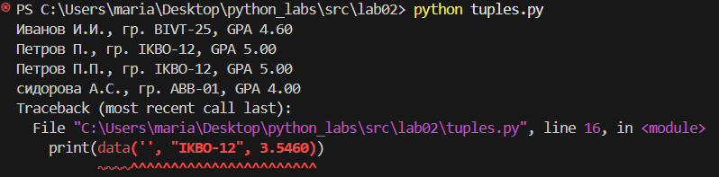


# Лабораторная работа 3
 

### Задание А


```python
import re
from collections import Counter

def normalize(text: str, *, casefold: bool = True, yooo: bool = True) -> str:
    """
    нормализирую текст(чищу)
    """
    if casefold:
        text = text.casefold()
    if yooo:
        text = text.replace('ё', 'е').replace('Ё', 'Е')
    probely = {'\t', '\r', '\n'}
    for char in probely:
        text = text.replace(char, ' ')
    text = re.sub(r'\s+', ' ', text).strip()
    
    return text

def tokenize(text: str) -> list[str]:
    """
    Токенизация текста 
    """
    pattern = r'\w+(?:-\w+)*'
    tokens = re.findall(pattern, text)
    
    return tokens

def count_freq(tokens: list[str]) -> dict[str, int]:
    """
    считаю сколько раз встречается слово
    """
    return dict(Counter(tokens))

def top_n(freq: dict[str, int], n: int = 5) -> list[tuple[str, int]]:
    """
    частые слова
    """
    sorted_items = sorted(freq.items(), key=lambda x: (-x[1], x[0]))
    
    return sorted_items[:n]

print("normalize:")
print(normalize("ПрИвЕт\nМИр\t")) 
print(normalize("ёжик, Ёлка")) 
print(normalize("Hello\r\nWorld")) 
print(normalize("  двойные   пробелы  "))

print("tokenize:")
print(tokenize("привет мир")) 
print(tokenize("hello,world!!!"))  
print(tokenize("по-настоящему круто"))  
print(tokenize("2025 год")) 
print(tokenize("emoji 😀 не слово"))

print("count_freq:")
tokens1 = ["a", "b", "a", "c", "b", "a"]
freq1 = count_freq(tokens1)
print(freq1) 

print("top_n:")
print(top_n(freq1, 2))  

tokens2 = ["bb", "aa", "bb", "aa", "cc"]
freq2 = count_freq(tokens2)
print(freq2)  
print(top_n(freq2, 2))
```

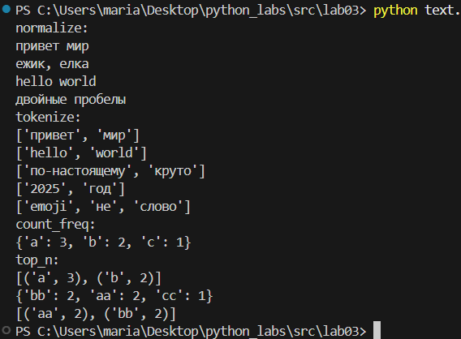


```python
# normalize
assert normalize("ПрИвЕт\nМИр\t") == "привет мир"
assert normalize("ёжик, Ёлка") == "ежик, елка"
print("✓")

# tokenize
assert tokenize("привет, мир!") == ["привет", "мир"]
assert tokenize("по-настоящему круто") == ["по-настоящему", "круто"]
assert tokenize("2025 год") == ["2025", "год"]
print("✓")

# count_freq + top_n
freq = count_freq(["a","b","a","c","b","a"])
assert freq == {"a":3, "b":2, "c":1}
assert top_n(freq, 2) == [("a",3), ("b",2)]
print("✓")

# тай-брейк по слову при равной частоте
freq2 = count_freq(["bb","aa","bb","aa","cc"])
assert top_n(freq2, 2) == [("aa",2), ("bb",2)]
print("✓")
```
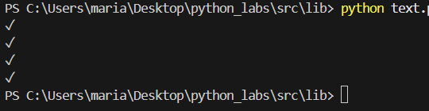


### Задание В

Мой код полностью соответствовал заданию - читал из stdin и корректно обрабатывал текст. Но появилась проблема с pipe в powershell из-за несовместимости кодировок между powershell (UTF-16) и python (UTF-8).
Поэтому я сделала несколько вариантов. В первом я обрабатываю символы срвзу как текст:
 
```python
import sys
from lib.text import *

def main():
    text = "Привет, мир! Привет!!!"
    
    normalized_text = normalize(text)
    tokens = tokenize(normalized_text)
    
    print(f"Всего слов: {len(tokens)}")
    print(f"Уникальных слов: {len(set(tokens))}")
    print("Топ-5:")
    
    freq_dict = count_freq(tokens)
    top_words = top_n(freq_dict, 5)
    
    for word, count in top_words:
        print(f"{word}:{count}")

if __name__ == "__main__":
    main()
```

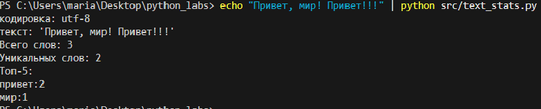

Во втором я ввожу текст не через echo, а просто запускаю код, который уже и обрабатывает текст:

```python
import sys
from lib.text import *

def main():
    text = sys.stdin.read()
    # читаю из стдина
    normalized_text = normalize(text)
    tokens = tokenize(normalized_text)
    
    print(f"Всего слов: {len(tokens)}")
    print(f"Уникальных слов: {len(set(tokens))}")
    print("Топ-5:")
    
    freq_dict = count_freq(tokens)
    top_words = top_n(freq_dict, 5)
    
    for word, count in top_words:
        print(f"{word}:{count}")

if __name__ == "__main__":
    main()
```

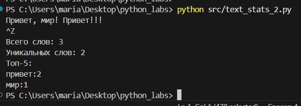

(Ctrl+Z + Enter)


### Задание со звездочкой

```python
import sys
import os
from lib.text import *

table = True  

def print_table(top_words):
    if not top_words:
        return
    
    max_word_len = max(len(word) for word, count in top_words)
    word_width = max(max_word_len, 5)
    
    print(f"{'слово':<{word_width}} | частота")
    print('-' * (word_width + 11))
    for word, count in top_words:
        print(f"{word:<{word_width}} | {count}")

def main():
    input_bytes = sys.stdin.buffer.read()
    text = input_bytes.decode('cp1251') #-кириллица
    
    normalized_text = normalize(text)
    tokens = tokenize(normalized_text)
    
    print(f"Всего слов: {len(tokens)}")
    print(f"Уникальных слов: {len(set(tokens))}")
    print("Топ-5:")
    
    freq_dict = count_freq(tokens)
    top_words = top_n(freq_dict, 5)
    
    if table:
        print_table(top_words)
    else:
        for word, count in top_words:
            print(f"{word}:{count}")

if __name__ == "__main__":
    main()
```

Как использовать:
```python
# Из файла
python text_stats_2.py < text_file.txt
# Через пайп
echo "Привет мир! Привет!!!" | python text_stats_2.py
```


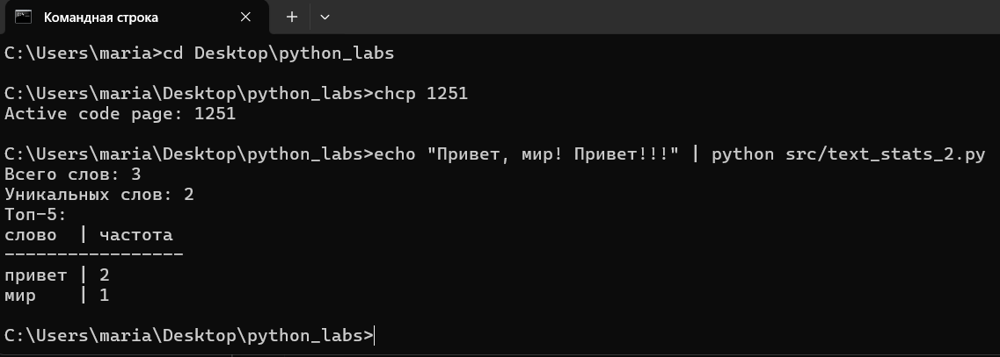

# Лабораторная работа 4
### Задание А
 ```python
 from pathlib import Path
import csv

def read_text(path: str | Path, encoding: str = "utf-8") -> str:
    """
    Читает файл и возвращает содержимое как строкчку

    """
    path = Path(path)
    return path.read_text(encoding=encoding)

def write_csv(rows: list[tuple | list], path: str | Path, header: tuple[str, ...] | None = None) -> None:
    """
    Создаёт CSV файл с данными
    rows - список строк данных
    header - заголовки столбцов
    Пример:
        write_csv([("word", "count"), ("test", 3)], "data.csv")
    """
    path = Path(path)
    # Создаю папки если их нет
    path.parent.mkdir(parents=True, exist_ok=True)
    # Проверяю что все строки одинаковой длины
    if rows:
        first_length = len(rows[0])
        for i, row in enumerate(rows):
            if len(row) != first_length:
                raise ValueError(f"Строка {i} имеет другую длину")
    # Записываю CSV
    with path.open('w', newline='', encoding='utf-8') as f:
        writer = csv.writer(f)
        if header:
            writer.writerow(header)
        writer.writerows(rows)
 ```

 #### Как менять кодировки:
 Если файл в другой кодировке, укажи её: encoding="cp1251"
 ```
    Пример:
        text = read_text("file.txt")
        text = read_text("file.txt", encoding="cp1251")
```


check.py:
```python
from io_txt_csv import read_text, write_csv

#создаю тестовый файл
from pathlib import Path
Path("data/lab04").mkdir(parents=True, exist_ok=True)
#файл
with open("data/lab04/input.txt", "w", encoding="utf-8") as f:
    f.write("йоу! прием, прием, как слышно? \nвторая строка.")
# Тестирую как читает
txt = read_text("data/lab04/input.txt")
print("Прочитанный текст:")
print(txt)
#Тестирую CSV
write_csv([("word", "count"), ("test", 3)], "data/lab04/check.csv")
print("CSV файл создан!")

#Проверяю что записалось
csv_content = read_text("data/lab04/check.csv")
print("CSV:")
print(csv_content)
```
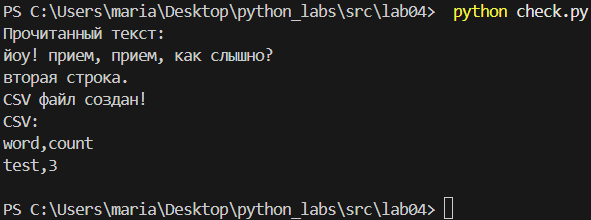
