# Лабораторная работа 1


## Задание 1

```python
name = input("Имя: ")
age = int(input("Возраст: "))
print(f"Привет, {name}! Через год тебе будет {age + 1}.")
```

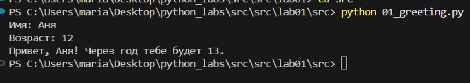


## Задание 2

```python
a = float(input("a: ").replace(",", "."))
b = float(input("b: ").replace(",", "."))
sum_ab = a + b
avg_ab = sum_ab / 2
print(f"sum={sum_ab:.2f}; avg={avg_ab:.2f}")
```

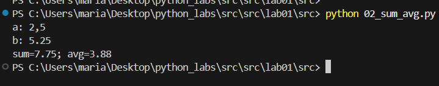


## Задание 3

```python
price = float(input("price: ").replace(",", "."))
discount = float(input("discount: ").replace(",", "."))
vat = float(input("vat: ").replace(",", "."))
base = price * (1 - discount / 100)
vat_amount = base * (vat / 100)
total = base + vat_amount
print(f"База после скидки: {base:.2f} ₽")
print(f"НДС:               {vat_amount:.2f} ₽")
print(f"Итого к оплате:    {total:.2f} ₽")
```

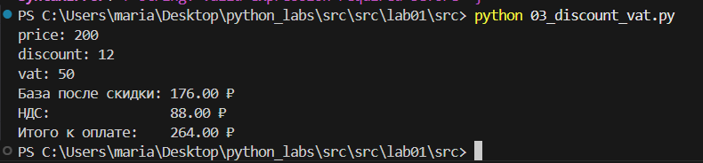


## Задание 4

```python
m = int(input("Минуты: "))
hours = m // 60
minutes = m % 60
print(f"{hours}:{minutes:02d}")
```

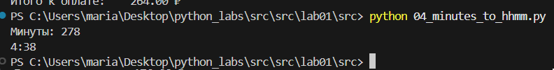

## Задание 5

```python
full_name = input("ФИО: ").strip()
chars = len(full_name.replace(' ', ''))

words = full_name.split()
initials = ''.join(word[0].upper() for word in words if word)


print(f"Инициалы: {initials}.")
print(f"Длина: {chars + 2}")
```

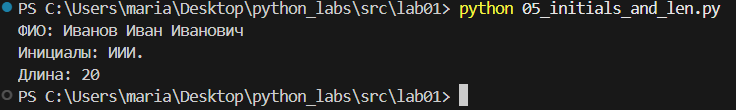


## Задание 7

```python
s = input()
result = ""
start = -1
for i in range(len(s)):
    if s[i].isupper():  
        result = result + s[i]  
        start = i  
        break
sec_pos = -1
for i in range(len(s)):
    if s[i].isdigit() and i + 1 < len(s):  
        result = result + s[i + 1]  
        sec_pos = i + 1  
        break
step = sec_pos - start
c_pos = sec_pos + step
while c_pos < len(s):
    if s[c_pos] == '.':  
        result = result + s[c_pos]  
        break 
    result = result + s[c_pos]  
    c_pos = c_pos + step  
print(result)
```

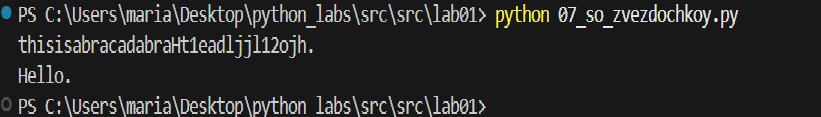


# Лабораторная работа 2

## Задание 1(A)

```python
def min_max(nums):
    """
    Находит минимальное и максимальное значение в списке
    """
    if not nums:
        raise ValueError
    return (min(nums), max(nums))

print('min_max:')
print(min_max([3, -1, 5, 5, 0]))     
print(min_max([42]))                 
print(min_max([-5, -2, -9]))
try:
    print(min_max([]))
except ValueError as mistake:
    print(mistake) 
print(min_max([1.5, 2, 2.0, -3.1])) 

def unique_sorted(nums):
    """
    Возвращает отсортированный список уникальных значений
    """
    if not nums:
        return []
    return sorted(set(nums))
print('unique_sorted:')
print(unique_sorted([3, 1, 2, 1, 3]))     
print(unique_sorted([]))                 
print(unique_sorted([-1, -1, 0, 2, 2]))         
print(unique_sorted([1.0, 1, 2.5, 2.5, 0])) 


def flatten(nums):
    """
    Преобразует список списков/кортежей в один список
    """
    resultat = []
    for number in nums:
        if not isinstance(number, (list, tuple)):
            raise TypeError('строка не строка строк матрицы')
        resultat.extend(number)
    return resultat
print('flatten:')
print(flatten([[1, 2], [3, 4]]))     
print(flatten([[1, 2], (3, 4, 5)]))                 
print(flatten([[1], [], [2, 3]]))         
try:
    print(flatten([[1, 2], "ab"]))
except TypeError as mistake:
    print(f"TypeError: {mistake}")

```

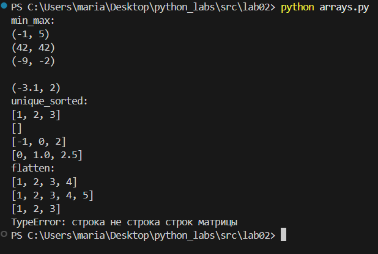


## Задание 2(B)

```python

def transpose(nums):
    """
    меняет строчки и столбики местами
    """
    if not nums:
        return []
    first_number = len(nums[0])
    if any(len(number) != first_number for number in nums):
        raise ValueError("рваная матрица")
    
    return list(map(list, zip(*nums)))

print('transpose:')
print(transpose([[1, 2, 3]]))
print(transpose([[1], [2], [3]]))
print(transpose([[1, 2], [3, 4]]))
print(transpose([]))
try:
    print(transpose([[1, 2], [3]]))
except ValueError as mistake:
    print(mistake)


def row_sums(nums):
    """
    Вычисляет суммы элементов каждой строчки матрицы
    """
    if not nums:
        return []
    first_number = len(nums[0])
    if any(len(number) != first_number for number in nums):
        raise ValueError("рваная матрица")
    
    return [sum(number) for number in nums]

print('row_sums:')
print(row_sums([[1, 2, 3], [4, 5, 6]]))
print(row_sums([[-1, 1], [10, -10]]))
print(row_sums([[0, 0], [0, 0]]))
try:
    print(row_sums([[1, 2], [3]]))
except ValueError as mistake:
    print(mistake)


def col_sums(nums):
    """
    Вычисляет суммы элементов каждого столбика в матрице
    """
    if not nums:
        return []
    first_number = len(nums[0])
    if any(len(number) != first_number for number in nums):
        raise ValueError("рваная матрица")
    
    return [sum(every) for every in zip(*nums)]
print(col_sums([[1, 2, 3], [4, 5, 6]]))
print(col_sums([[-1, 1], [10, -10]]))
print(col_sums([[0, 0], [0, 0]]))
try:
    print(col_sums([[1, 2], [3]]))
except ValueError as mistake:
    print(mistake)


```
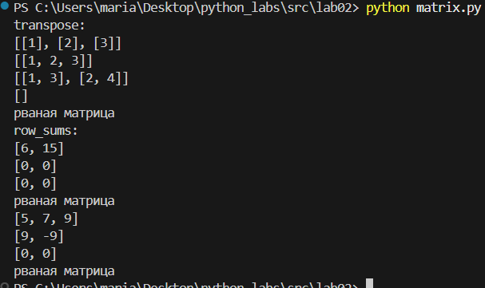


## Задание 3(C)

```python

def data(chars):
    """
    переводит данные студента в строчку с инициалами
    """
    if not isinstance(chars, tuple) or len(chars) != 3:
        raise ValueError()
    
    if not isinstance(chars[0], str):
        raise TypeError()
    if not isinstance(chars[1], str):
        raise TypeError()
    if not isinstance(chars[2], (int, float)):
        raise TypeError()
    
    student_fio = ' '.join(chars[0].split()) 
    student_group = chars[1].strip()
    
    if not student_fio:
        raise ValueError()
    if not student_group:
        raise ValueError()
    
    gpa_value = float(chars[2])
    student_gpa = f"{gpa_value:.2f}"
    el_fio = student_fio.split()
    
    if len(el_fio) < 2 or len(el_fio) > 3:
        raise ValueError()
    
    surname = el_fio[0]
    initials = '.'.join(name[0].upper() for name in el_fio[1:]) + '.'
    fio_new = f"{surname} {initials}"
    
    return f"{fio_new}, гр. {student_group}, GPA {student_gpa}"

print(data(("Иванов Иван Иванович", "BIVT-25", 4.6)))
print(data(("Петров Пётр", "IKBO-12", 5.0)))
print(data(("Петров Пётр Петрович", "IKBO-12", 5.0)))
print(data(("  сидорова  анна   сергеевна ", "ABB-01", 3.999)))

```

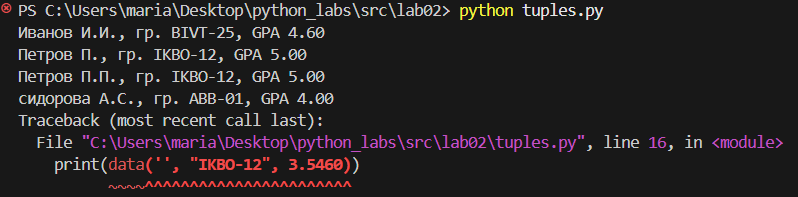


# Лабораторная работа 3
 

## Задание А


```python
import re
from collections import Counter

def normalize(text: str, *, casefold: bool = True, yooo: bool = True) -> str:
    """
    нормализирую текст(чищу)
    """
    if casefold:
        text = text.casefold()
    if yooo:
        text = text.replace('ё', 'е').replace('Ё', 'Е')
    probely = {'\t', '\r', '\n'}
    for char in probely:
        text = text.replace(char, ' ')
    text = re.sub(r'\s+', ' ', text).strip()
    
    return text

def tokenize(text: str) -> list[str]:
    """
    Токенизация текста 
    """
    pattern = r'\w+(?:-\w+)*'
    tokens = re.findall(pattern, text)
    
    return tokens

def count_freq(tokens: list[str]) -> dict[str, int]:
    """
    считаю сколько раз встречается слово
    """
    return dict(Counter(tokens))

def top_n(freq: dict[str, int], n: int = 5) -> list[tuple[str, int]]:
    """
    частые слова
    """
    sorted_items = sorted(freq.items(), key=lambda x: (-x[1], x[0]))
    
    return sorted_items[:n]

print("normalize:")
print(normalize("ПрИвЕт\nМИр\t")) 
print(normalize("ёжик, Ёлка")) 
print(normalize("Hello\r\nWorld")) 
print(normalize("  двойные   пробелы  "))

print("tokenize:")
print(tokenize("привет мир")) 
print(tokenize("hello,world!!!"))  
print(tokenize("по-настоящему круто"))  
print(tokenize("2025 год")) 
print(tokenize("emoji 😀 не слово"))

print("count_freq:")
tokens1 = ["a", "b", "a", "c", "b", "a"]
freq1 = count_freq(tokens1)
print(freq1) 

print("top_n:")
print(top_n(freq1, 2))  

tokens2 = ["bb", "aa", "bb", "aa", "cc"]
freq2 = count_freq(tokens2)
print(freq2)  
print(top_n(freq2, 2))
```

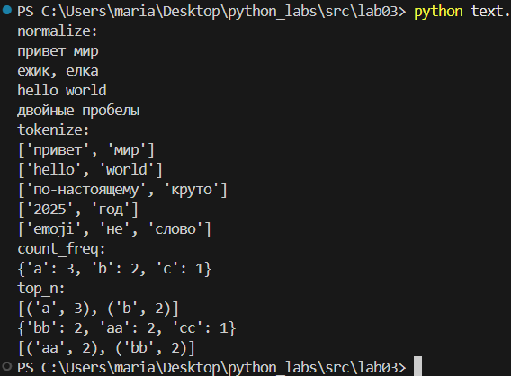


```python
# normalize
assert normalize("ПрИвЕт\nМИр\t") == "привет мир"
assert normalize("ёжик, Ёлка") == "ежик, елка"
print("✓")

# tokenize
assert tokenize("привет, мир!") == ["привет", "мир"]
assert tokenize("по-настоящему круто") == ["по-настоящему", "круто"]
assert tokenize("2025 год") == ["2025", "год"]
print("✓")

# count_freq + top_n
freq = count_freq(["a","b","a","c","b","a"])
assert freq == {"a":3, "b":2, "c":1}
assert top_n(freq, 2) == [("a",3), ("b",2)]
print("✓")

# тай-брейк по слову при равной частоте
freq2 = count_freq(["bb","aa","bb","aa","cc"])
assert top_n(freq2, 2) == [("aa",2), ("bb",2)]
print("✓")
```
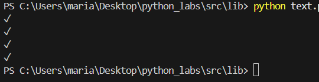


## Задание В

Мой код полностью соответствовал заданию - читал из stdin и корректно обрабатывал текст. Но появилась проблема с pipe в powershell из-за несовместимости кодировок между powershell (UTF-16) и python (UTF-8).
Поэтому я сделала несколько вариантов. В первом я обрабатываю символы срвзу как текст:
 
```python
import sys
from lib.text import *

def main():
    text = "Привет, мир! Привет!!!"
    
    normalized_text = normalize(text)
    tokens = tokenize(normalized_text)
    
    print(f"Всего слов: {len(tokens)}")
    print(f"Уникальных слов: {len(set(tokens))}")
    print("Топ-5:")
    
    freq_dict = count_freq(tokens)
    top_words = top_n(freq_dict, 5)
    
    for word, count in top_words:
        print(f"{word}:{count}")

if __name__ == "__main__":
    main()
```

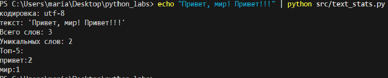

Во втором я ввожу текст не через echo, а просто запускаю код, который уже и обрабатывает текст:

```python
import sys
from lib.text import *

def main():
    text = sys.stdin.read()
    # читаю из стдина
    normalized_text = normalize(text)
    tokens = tokenize(normalized_text)
    
    print(f"Всего слов: {len(tokens)}")
    print(f"Уникальных слов: {len(set(tokens))}")
    print("Топ-5:")
    
    freq_dict = count_freq(tokens)
    top_words = top_n(freq_dict, 5)
    
    for word, count in top_words:
        print(f"{word}:{count}")

if __name__ == "__main__":
    main()
```

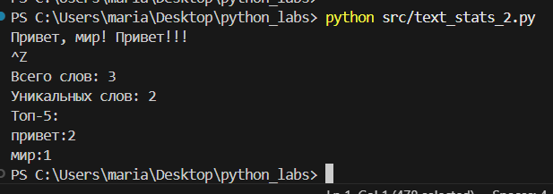

(Ctrl+Z + Enter)


## Задание со звездочкой

```python
import sys
import os
from lib.text import *

table = True  

def print_table(top_words):
    if not top_words:
        return
    
    max_word_len = max(len(word) for word, count in top_words)
    word_width = max(max_word_len, 5)
    
    print(f"{'слово':<{word_width}} | частота")
    print('-' * (word_width + 11))
    for word, count in top_words:
        print(f"{word:<{word_width}} | {count}")

def main():
    input_bytes = sys.stdin.buffer.read()
    text = input_bytes.decode('cp1251') #-кириллица
    
    normalized_text = normalize(text)
    tokens = tokenize(normalized_text)
    
    print(f"Всего слов: {len(tokens)}")
    print(f"Уникальных слов: {len(set(tokens))}")
    print("Топ-5:")
    
    freq_dict = count_freq(tokens)
    top_words = top_n(freq_dict, 5)
    
    if table:
        print_table(top_words)
    else:
        for word, count in top_words:
            print(f"{word}:{count}")

if __name__ == "__main__":
    main()
```

Как использовать:
```python
# Из файла
python text_stats_2.py < text_file.txt
# Через пайп
echo "Привет мир! Привет!!!" | python text_stats_2.py
```


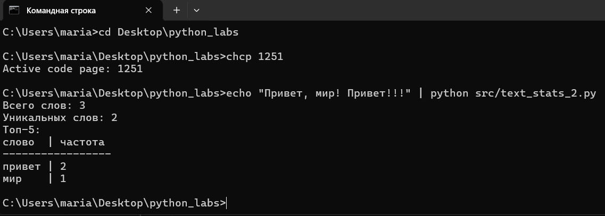

# Лабораторная работа 4
## Задание А
 ```python
 from pathlib import Path
import csv

def read_text(path: str | Path, encoding: str = "utf-8") -> str:
    """
    Читает файл и возвращает содержимое как строкчку

    """
    path = Path(path)
    return path.read_text(encoding=encoding)

def write_csv(rows: list[tuple | list], path: str | Path, header: tuple[str, ...] | None = None) -> None:
    """
    Создаёт CSV файл с данными
    rows - список строк данных
    header - заголовки столбцов
    Пример:
        write_csv([("word", "count"), ("test", 3)], "data.csv")
    """
    path = Path(path)
    # Создаю папки если их нет
    path.parent.mkdir(parents=True, exist_ok=True)
    # Проверяю что все строки одинаковой длины
    if rows:
        first_length = len(rows[0])
        for i, row in enumerate(rows):
            if len(row) != first_length:
                raise ValueError(f"Строка {i} имеет другую длину")
    # Записываю CSV
    with path.open('w', newline='', encoding='utf-8') as f:
        writer = csv.writer(f)
        if header:
            writer.writerow(header)
        writer.writerows(rows)
 ```

 #### Как менять кодировки:
 Если файл в другой кодировке, укажи её: encoding="cp1251"
 ```
    Пример:
        text = read_text("file.txt")
        text = read_text("file.txt", encoding="cp1251")
```


check.py:
```python
from io_txt_csv import read_text, write_csv

#создаю тестовый файл
from pathlib import Path
Path("data/lab04").mkdir(parents=True, exist_ok=True)
#файл
with open("data/lab04/input.txt", "w", encoding="utf-8") as f:
    f.write("йоу! прием, прием, как слышно? \nвторая строка.")
# Тестирую как читает
txt = read_text("data/lab04/input.txt")
print("Прочитанный текст:")
print(txt)
#Тестирую CSV
write_csv([("word", "count"), ("test", 3)], "data/lab04/check.csv")
print("CSV файл создан!")

#Проверяю что записалось
csv_content = read_text("data/lab04/check.csv")
print("CSV:")
print(csv_content)
```
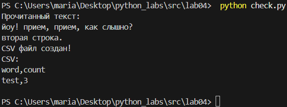

## Задание В

```python
import sys
import os
from io_txt_csv import read_text, write_csv
#пробую разные пути для импорта
try:
    from lib.text import normalize, tokenize, count_freq, top_n
except ImportError:
    try:
        sys.path.append('C:/Users/maria/Desktop/python_labs/src')
        from lib.text import normalize, tokenize, count_freq, top_n
    except ImportError:
        sys.exit(1)
try:
    text = read_text('data/lab04/input.txt')
except FileNotFoundError as e:
    print(f"Ошибка: {e}") 
    sys.exit(1)
tokens = tokenize(normalize(text))
word_counts = count_freq(tokens)
top_5 = top_n(word_counts, 5)
top_list = top_n(word_counts, len(word_counts.keys()))

write_csv(top_list, 'data/lab04/report.csv', ('word', 'count'))

print(f"Всего слов: {len(tokens)}") 
print(f"Уникальных слов: {len(set(tokens))}")

if top_5:
    max_len = max(len(word) for word, count in top_5)
    max_len = max(max_len, 5)
    
    first_line = 'слово' + ' ' * (max_len - 5) + '| частота'
    print(first_line)
    print('-' * len(first_line))
    for word, count in top_5:
        print(f'{word}' + ' ' * (max_len - len(word)) + f'| {count}')
else:
    print("Топ-5: нет данных")
```

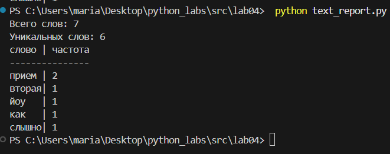

# ЛР5 — JSON и конвертации (JSON↔CSV, CSV→XLSX): Техническое задание

#### как запустить
Установка зависимостей
```
    pip install -r requirements.txt
```
Запуск тестового скрипта
```
    python test_lab05.py
```
## Задание A — JSON ↔ CSV

```python
import json
import csv
from pathlib import Path
import sys
import os

sys.path.append(os.path.join(os.path.dirname(__file__), '..'))
from lib.io_helpers import read_json, read_csv

def json_to_csv(json_path: str, csv_path: str) -> None:
    """
    JSON-файл в CSV
    список словарей [{...}, {...}], заполняет отсутствующие поля пустыми строчками
    """
    #чтение и валидация JSON
    data = read_json(json_path)
    #определение полей 
    all_fields = set()
    for item in data:
        all_fields.update(item.keys())
    fieldnames = sorted(all_fields)
    #создание директории для выходного файла, если её нет
    output_path = Path(csv_path)
    output_path.parent.mkdir(parents=True, exist_ok=True)
    #запись CSV
    with output_path.open('w', newline='', encoding='utf-8') as csv_file:
        writer = csv.DictWriter(csv_file, fieldnames=fieldnames)
        writer.writeheader()
        for item in data:
            #заполнение отсутствующих полей пустыми строчками
            row = {field: item.get(field, '') for field in fieldnames}
            writer.writerow(row)
def csv_to_json(csv_path: str, json_path: str) -> None:
    """
    CSV в JSON 
    """
    #чтение и валидация CSV
    fieldnames, rows = read_csv(csv_path)
    #создание директории для выходного файла, если её нет
    output_path = Path(json_path)
    output_path.parent.mkdir(parents=True, exist_ok=True)
    #запись JSON
    with output_path.open('w', encoding='utf-8') as json_file:
        json.dump(rows, json_file, ensure_ascii=False, indent=2)
```

## Задание B — CSV → XLSX
 
 ```python
 import csv
from pathlib import Path
from openpyxl import Workbook
from openpyxl.utils import get_column_letter
import sys
import os

sys.path.append(os.path.join(os.path.dirname(__file__), '..'))
from lib.io_helpers import read_csv
def csv_to_xlsx(csv_path: str, xlsx_path: str) -> None:
    """
    конвертирует CSV в XLSX
    использовать openpyxl
    колонки не менее 8 символов
    """
    #чтение и валидация CSV
    fieldnames, rows = read_csv(csv_path)
    #создание директории для выходного файла, если её нет
    output_path = Path(xlsx_path)
    output_path.parent.mkdir(parents=True, exist_ok=True)
    #создание Excel workbook
    wb = Workbook()
    ws = wb.active
    ws.title = "лист1"
    #запись заголовков
    ws.append(fieldnames)
    # Запись данных
    for row in rows:
        ws.append([row.get(field, '') for field in fieldnames])
    #настраиваю ширину колонок
    for col_num, column_title in enumerate(fieldnames, 1):
        max_length = 0
        column_letter = get_column_letter(col_num)
        #длина заголовка
        max_length = max(max_length, len(str(column_title)))
        #длина данных в колонке
        for row_num in range(2, ws.max_row + 1):
            cell_value = ws[f"{column_letter}{row_num}"].value
            if cell_value:
                max_length = max(max_length, len(str(cell_value)))
        #ширина 8 символов
        adjusted_width = max(8, max_length + 2)
        ws.column_dimensions[column_letter].width = adjusted_width
    #сохраняю
    wb.save(output_path)
 ```


 #### мини - наборы
 ##### samples
people.json
 ```
 [
  {
    "name": "Alice",
    "age": 22,
    "city": "SPB"
  },
  {
    "name": "Bob",
    "age": 25,
    "city": "Moscow"
  },
  {
    "name": "Charlie",
    "age": 30,
    "city": "London"
  }
]
 ```
people.csv
 ```
 name,age,city
Alice,22,SPB
Bob,25,Moscow
 ```
cities.csv
 ```
 city,country,population
SPB,Russia,5000000
Moscow,Russia,12000000
London,UK,9000000
 ```

 #### test_lab05.py

 ```python
 import sys
import os
sys.path.append(os.path.join(os.path.dirname(__file__), 'src'))
try:
    #импортирую
    from lab05.json_csv import json_to_csv, csv_to_json
    from lab05.csv_xlsx import csv_to_xlsx
    print("тест")
    os.makedirs("data/lab05/out", exist_ok=True)
    #тестирую
    print("1 - JSON → CSV")
    json_to_csv("data/lab05/samples/people.json", "data/lab05/out/people_from_json.csv")
    print("2 - CSV → JSON")
    csv_to_json("data/lab05/samples/people.csv", "data/lab05/out/people_from_csv.json")
    print("3 - CSV → XLSX")
    csv_to_xlsx("data/lab05/samples/people.csv", "data/lab05/out/people.xlsx")
    print("4 - Cities CSV → XLSX.")
    csv_to_xlsx("data/lab05/samples/cities.csv", "data/lab05/out/cities.xlsx")
    print("\n✅ УРА РАБОТАЕТ")
    print("результ: data/lab05/out/")
    
except Exception as e:
    print(f"не работает: {e}")
    import traceback
    traceback.print_exc()
 ```

 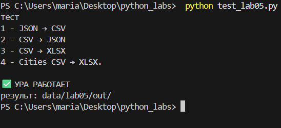

## Итого в работе получилось реализовать

 Двусторонняя конвертация JSON ↔ CSV

Экспортировать в Excel из CSV

Автоширина колонок в Excel

Обработать ошибоки (пустые файлы и неверные форматы)

Поддержка UTF-8 (кириллица)

# ЛР6 — CLI‑утилиты с argparse (cat/grep‑lite + конвертеры): Техническое задание
`Цель:` Научиться создавать консольные инструменты с аргументами командной строки, подкомандами и флагами.
    Связь: продолжение ЛР5 (работа с JSON/CSV/XLSX) и подготовка к ЛР7 (тестирование).
    Основная задача — обернуть существующие функции конвертации и анализа текста в CLI‑оболочки с помощью argparse.

## src/lab06/cli_text.py

```python
import argparse
import sys
import os
from pathlib import Path
import re
from collections import Counter

def read_text_simple(path: str, encoding: str = "utf-8") -> str:
    """
    чтение текста
    """
    path = Path(path)
    if not path.exists():
        raise FileNotFoundError(f"Файл не найден: {path}")
    return path.read_text(encoding=encoding)

try:
    from lib.text import normalize, tokenize, count_freq, top_n
except ImportError:
    try:
        sys.path.append(os.path.join(os.path.dirname(__file__), '..'))
        from lib.text import normalize, tokenize, count_freq, top_n
    except ImportError:
        print("не удалось импортировать функции из lib/text.py")
        sys.exit(1)

def print_table(top_words):
    if not top_words:
        return
    max_word_len = max(len(word) for word, count in top_words)
    word_width = max(max_word_len, 5)
    print(f"{'слово':<{word_width}} | частота")
    print('-' * (word_width + 11))
    for word, count in top_words:
        print(f"{word:<{word_width}} | {count}")

def cat_command(args):
    """
    cat - вывод содержимого файла
    """
    try:
        content = read_text_simple(args.input)
        lines = content.split('\n')
        for i, line in enumerate(lines, 1):
            if args.n: #проверка флага в аргументах командной строки
                print(f"{i:6d}\t{line}")
            else:
                print(line)
                
    except FileNotFoundError:
        print(f"файл '{args.input}' не найден")
        sys.exit(1)
    except Exception as e:
        print(f"ошибка при чтении файла: {e}")
        sys.exit(1)

def stats_command(args):
    """
    stats - анализ частот слов
    """
    try:
        text = read_text_simple(args.input, encoding='utf-8')
        normalized_text = normalize(text)
        tokens = tokenize(normalized_text)
        word_counts = count_freq(tokens)
        top_words = top_n(word_counts, args.top)
        
        print(f"Всего слов: {len(tokens)}")
        print(f"Уникальных слов: {len(set(tokens))}")
        print(f"Топ-{args.top}:")
        
        print_table(top_words)
            
    except FileNotFoundError:
        print(f"Ошибка: файл '{args.input}' не найден")
        sys.exit(1)
    except Exception as e:
        print(f"ошибка при анализе текста: {e}")
        sys.exit(1)

def main():
    '''
    хелпер
    '''
    parser = argparse.ArgumentParser(     #ArgumentParser = "анализатор аргументов", cоздает объект, который умеет парсить командную строку
        description="CLI-утилиты для анализа текста",
        formatter_class=argparse.RawDescriptionHelpFormatter   #типа форматируй справку как есть, без авто-переносов
    )                   #argparse.RawDescriptionHelpFormatter - это встроенный класс в библиотеке argparse
    subparsers = parser.add_subparsers(dest="command", help="Доступные команды")

    cat_parser = subparsers.add_parser("cat", help="Вывести содержимое файла")
    cat_parser.add_argument("--input", required=True, help="Путь к входному файлу") 
    cat_parser.add_argument("-n", action="store_true", help="Нумеровать строки") 
    cat_parser.set_defaults(func=cat_command)

    stats_parser = subparsers.add_parser("stats", help="частоты слов в тексте")
    stats_parser.add_argument("input", help="Путь к текстовому файлу") 
    stats_parser.add_argument("top", nargs='?', type=int, default=5, help="Кол-во топ-слов")  
    stats_parser.set_defaults(func=stats_command)

    args = parser.parse_args()
    if args.command is None:
        parser.print_help()
        sys.exit(1)
    args.func(args)

if __name__ == "__main__":
    main()
```
## cli_text.py
 Утилиты для работы с текстом

**Функции обработки текста(3 лаба):**
- `normalize()` - нормализация текста (приведение к нижнему регистру, удаление знаков препинания)
- `tokenize()` - разбивка текста на слова-токены
- `count_freq()` - подсчет частоты слов
- `top_n()` - получение N самых частых слов

**CLI команды:**
- `cat` - вывод содержимого файла
  - `--input` - путь к файлу (обязательный)
  - `-n` - флаг нумерации строк
- `stats` - анализ частот слов
  - `input` - путь к файлу (позиционный аргумент)
  - `top` - количество топ-слов (опциональный, по умолчанию 5)

**Обработка ошибок:**
- `FileNotFoundError` - файл не найден
- `Exception` - общие ошибки, описание которых я писала рядом

## Примеры использования

### Анализ текста
```bash
# Вывод файла с нумерацией
python -m src.lab06.cli_text cat --input data/lab06/sample_text.txt -n

# Анализ частот слов
python -m src.lab06.cli_text stats data/lab06/sample_text.txt 3
```


## src/lab06/cli_convert.py

```python
import argparse
import sys
import os
from pathlib import Path
try:
    from lab05.json_csv import json_to_csv, csv_to_json
    from lab05.csv_xlsx import csv_to_xlsx
except ImportError:
    sys.path.append(os.path.join(os.path.dirname(__file__), '..'))
    from lab05.json_csv import json_to_csv, csv_to_json
    from lab05.csv_xlsx import csv_to_xlsx

def json2csv_command(args):
    """
    JSON в CSV
    """
    try:
        json_to_csv(args.input, args.output)
        print(f"сконвертировано: {args.input} → {args.output}")
    except Exception as e:
        print(f"oшибка: {e}")
        sys.exit(1)

def csv2json_command(args):
    """
    CSV в JSON
    """
    try:
        csv_to_json(args.input, args.output)
        print(f"сконвертировано: {args.input} → {args.output}")
    except Exception as e:
        print(f"oшибка: {e}")
        sys.exit(1)

def csv2xlsx_command(args):
    """
    CSV в XLSx
    """
    try:
        csv_to_xlsx(args.input, args.output)
        print(f"сконвертировано: {args.input} → {args.output}")
    except Exception as e:
        print(f"oшибка: {e}")
        sys.exit(1)

def main():
    parser = argparse.ArgumentParser(
        description="CLI-конвертеры данных между форматами JSON, CSV, XLSX",
        formatter_class=argparse.RawDescriptionHelpFormatter
    )
    subparsers = parser.add_subparsers(dest="command", help="Доступные команды конвертации")

    #json2csv
    json2csv_parser = subparsers.add_parser("json2csv", help="Конвертировать JSON в CSV")
    json2csv_parser.add_argument("--in", dest="input", required=True, help="Входной JSON файл") #--in - как аргумент называется в командной строке, как input в args
    json2csv_parser.add_argument("--out", dest="output", required=True, help="Выходной CSV файл")
    json2csv_parser.set_defaults(func=json2csv_command)

    #csv2json
    csv2json_parser = subparsers.add_parser("csv2json", help="Конвертировать CSV в JSON")
    csv2json_parser.add_argument("--in", dest="input", required=True, help="Входной CSV файл")
    csv2json_parser.add_argument("--out", dest="output", required=True, help="Выходной JSON файл")
    csv2json_parser.set_defaults(func=csv2json_command)

    #csv2xlsx
    csv2xlsx_parser = subparsers.add_parser("csv2xlsx", help="Конвертировать CSV в XLSX")
    csv2xlsx_parser.add_argument("--in", dest="input", required=True, help="Входной CSV файл")
    csv2xlsx_parser.add_argument("--out", dest="output", required=True, help="Выходной XLSX файл")
    csv2xlsx_parser.set_defaults(func=csv2xlsx_command)
    args = parser.parse_args()
    if args.command is None:
        parser.print_help()
        sys.exit(1)
    args.func(args)

    '''
    Traceback (most recent call last):
  File "...", line X, in <module>
    args.func(args)
AttributeError: 'Namespace' object has no attribute 'func'
без использования проверки введения пользователем значений
    '''

if __name__ == "__main__":
    main()
```


## cli_convert.py
Конвертеры между форматами данных

**Использует функции из ЛР5:**
- `json_to_csv()` - JSON → CSV
- `csv_to_json()` - CSV → JSON  
- `csv_to_xlsx()` - CSV → XLSX

**Команды:**
- `json2csv --in <input> --out <output>`
- `csv2json --in <input> --out <output>`
- `csv2xlsx --in <input> --out <output>`

```Bash
# JSON в CSV
python -m src.lab06.cli_convert json2csv --in data/lab05/samples/people.json --out data/lab06/out/people.csv

 # CSV в XLSX
 python -m src.lab06.cli_convert csv2xlsx --in data/lab05/samples/people.csv --out data/lab06/out/people.xlsx
```


## Cправка:

```Bash
python -m src.lab06.cli_text --help
python -m src.lab06.cli_convert  --help
```


## Выполненные задачи
-  Реализованы CLI-утилиты для анализа текста (`cat`, `stats`)
-  Реализованы CLI-конвертеры данных между форматами
-  Использованы функции из предыдущих лабораторных работ
-  Добавлена обработка ошибок и справка по командам


