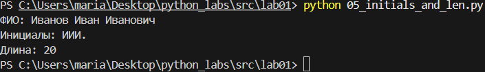

## Лабораторная работа 1


Задание 1

```python
name = input("Имя: ")
age = int(input("Возраст: "))
print(f"Привет, {name}! Через год тебе будет {age + 1}.")
```


Задание 2

```python
a = float(input("a: ").replace(",", "."))
b = float(input("b: ").replace(",", "."))
sum_ab = a + b
avg_ab = sum_ab / 2
print(f"sum={sum_ab:.2f}; avg={avg_ab:.2f}")
```


Задание 3

```python
price = float(input("price: ").replace(",", "."))
discount = float(input("discount: ").replace(",", "."))
vat = float(input("vat: ").replace(",", "."))
base = price * (1 - discount / 100)
vat_amount = base * (vat / 100)
total = base + vat_amount
print(f"База после скидки: {base:.2f} ₽")
print(f"НДС:               {vat_amount:.2f} ₽")
print(f"Итого к оплате:    {total:.2f} ₽")
```


Задание 4

```python
m = int(input("Минуты: "))
hours = m // 60
minutes = m % 60
print(f"{hours}:{minutes:02d}")
```


Задание 5

```python
full_name = input("ФИО: ").strip()
chars = len(full_name.replace(' ', ''))

words = full_name.split()
initials = ''.join(word[0].upper() for word in words if word)


print(f"Инициалы: {initials}.")
print(f"Длина: {chars + 2}")
```




Задание 7

```python
s = input()
result = ""
start = -1
for i in range(len(s)):
    if s[i].isupper():  
        result = result + s[i]  
        start = i  
        break
sec_pos = -1
for i in range(len(s)):
    if s[i].isdigit() and i + 1 < len(s):  
        result = result + s[i + 1]  
        sec_pos = i + 1  
        break
step = sec_pos - start
c_pos = sec_pos + step
while c_pos < len(s):
    if s[c_pos] == '.':  
        result = result + s[c_pos]  
        break 
    result = result + s[c_pos]  
    c_pos = c_pos + step  
print(result)
```


## Лабораторная работа 2

Задание 1(A)

```python
def min_max(nums):
    """
    Находит минимальное и максимальное значение в списке
    """
    if not nums:
        raise ValueError
    return (min(nums), max(nums))

print('min_max:')
print(min_max([3, -1, 5, 5, 0]))     
print(min_max([42]))                 
print(min_max([-5, -2, -9]))
try:
    print(min_max([]))
except ValueError as mistake:
    print(mistake) 
print(min_max([1.5, 2, 2.0, -3.1])) 

def unique_sorted(nums):
    """
    Возвращает отсортированный список уникальных значений
    """
    if not nums:
        return []
    return sorted(set(nums))
print('unique_sorted:')
print(unique_sorted([3, 1, 2, 1, 3]))     
print(unique_sorted([]))                 
print(unique_sorted([-1, -1, 0, 2, 2]))         
print(unique_sorted([1.0, 1, 2.5, 2.5, 0])) 


def flatten(nums):
    """
    Преобразует список списков/кортежей в один список
    """
    resultat = []
    for number in nums:
        if not isinstance(number, (list, tuple)):
            raise TypeError('строка не строка строк матрицы')
        resultat.extend(number)
    return resultat
print('flatten:')
print(flatten([[1, 2], [3, 4]]))     
print(flatten([[1, 2], (3, 4, 5)]))                 
print(flatten([[1], [], [2, 3]]))         
try:
    print(flatten([[1, 2], "ab"]))
except TypeError as mistake:
    print(f"TypeError: {mistake}")

```


Задание 2(B)

```python

def transpose(nums):
    """
    меняет строчки и столбики местами
    """
    if not nums:
        return []
    first_number = len(nums[0])
    if any(len(number) != first_number for number in nums):
        raise ValueError("рваная матрица")
    
    return list(map(list, zip(*nums)))

print('transpose:')
print(transpose([[1, 2, 3]]))
print(transpose([[1], [2], [3]]))
print(transpose([[1, 2], [3, 4]]))
print(transpose([]))
try:
    print(transpose([[1, 2], [3]]))
except ValueError as mistake:
    print(mistake)


def row_sums(nums):
    """
    Вычисляет суммы элементов каждой строчки матрицы
    """
    if not nums:
        return []
    first_number = len(nums[0])
    if any(len(number) != first_number for number in nums):
        raise ValueError("рваная матрица")
    
    return [sum(number) for number in nums]

print('row_sums:')
print(row_sums([[1, 2, 3], [4, 5, 6]]))
print(row_sums([[-1, 1], [10, -10]]))
print(row_sums([[0, 0], [0, 0]]))
try:
    print(row_sums([[1, 2], [3]]))
except ValueError as mistake:
    print(mistake)


def col_sums(nums):
    """
    Вычисляет суммы элементов каждого столбика в матрице
    """
    if not nums:
        return []
    first_number = len(nums[0])
    if any(len(number) != first_number for number in nums):
        raise ValueError("рваная матрица")
    
    return [sum(every) for every in zip(*nums)]
print(col_sums([[1, 2, 3], [4, 5, 6]]))
print(col_sums([[-1, 1], [10, -10]]))
print(col_sums([[0, 0], [0, 0]]))
try:
    print(col_sums([[1, 2], [3]]))
except ValueError as mistake:
    print(mistake)


```


Задание 3(C)

```python

def data(chars):
    """
    переводит данные студента в строчку с иницыалами
    """
    student_fio = ' '.join(chars[0].split()) 
    student_group = chars[1].strip()
    student_gpa = f"{float(chars[2]):.2f}"
    el_fio = student_fio.split()
    surname = el_fio[0]
    initials = '.'.join(name[0].upper() for name in el_fio[1:]) + '.'
    fio_new = f"{surname} {initials}"
    
    return f"{fio_new}, гр. {student_group}, GPA {student_gpa}"

print(data(("Иванов Иван Иванович", "BIVT-25", 4.6)))
print(data(("Петров Пётр", "IKBO-12", 5.0)))
print(data(("Петров Пётр Петрович", "IKBO-12", 5.0)))
print(data(("  сидорова  анна   сергеевна ", "ABB-01", 3.999)))
print(data('', "IKBO-12", 3.5460))

```


